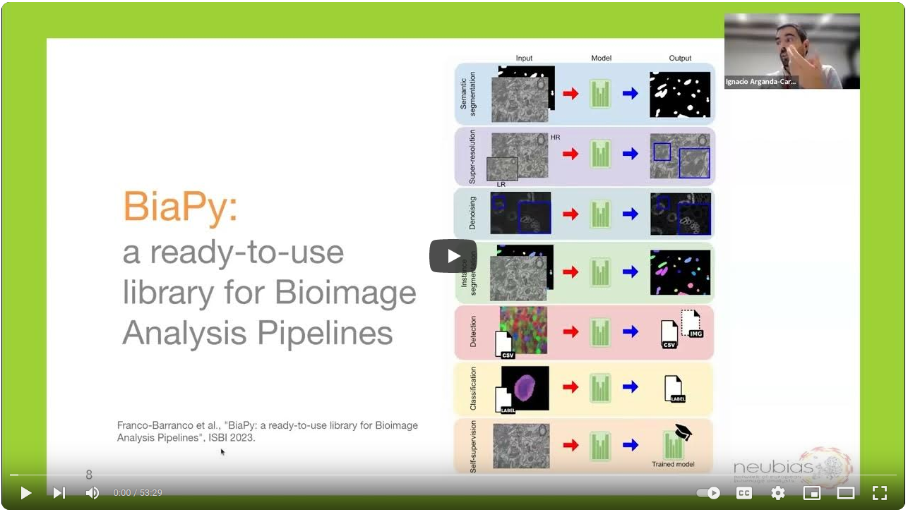

# BiaPy: Bioimage analysis pipelines in Python

<p align="left">
    <a href="https://www.python.org/">
      </a>
    <a href= "https://pytorch.org/">
      </a>
    <a href= "https://pypi.org/project/biapy/">
      </a>
    <a href= "https://github.com/BiaPyX/BiaPy/blob/master/LICENSE">
      </a>
    <a href= "https://biapy.readthedocs.io/en/latest/">
      </a>
    <a href= "https://ieeexplore.ieee.org/abstract/document/10230593">
      </a>
</p>

[BiaPy](https://github.com/BiaPyX/BiaPy) is an open source Python library for building bioimage analysis pipelines. This repository is actively under development by the Biomedical Computer Vision group at the [University of the Basque Country](https://www.ehu.eus/en/en-home) and the [Donostia International Physics Center](http://dipc.ehu.es/). 

The library provides an easy way to create image processing pipelines that are typically used in the analysis of biology microscopy images in 2D and 3D. Namely, BiaPy contains ready-to-use solutions for the tasks of [semantic segmentation](https://biapy.readthedocs.io/en/latest/workflows/semantic_segmentation.html), [instance segmentation](https://biapy.readthedocs.io/en/latest/workflows/instance_segmentation.html), [object detection](https://biapy.readthedocs.io/en/latest/workflows/detection.html), [image denoising](https://biapy.readthedocs.io/en/latest/workflows/denoising.html), [single image super-resolution](https://biapy.readthedocs.io/en/latest/workflows/super_resolution.html), [self-supervised learning](https://biapy.readthedocs.io/en/latest/workflows/self_supervision.html) and [image classification](https://biapy.readthedocs.io/en/latest/workflows/classification.html). The source code is based on Pytorch as backend. Given BiaPy’s deep learning based core, a machine with a graphics processing unit (GPU) is recommended for fast training and execution.                                                                                                                                


## Description video
Find a gentle introduction to BiaPy in this video of Ignacio Arganda-Carreras in [the Virtual Pub of Euro-BioImaging](https://www.eurobioimaging.eu/about-us/virtual-pub):

[](https://www.youtube.com/watch?v=t5cqpjWQS9Q "BiaPy: a ready-to-use library for Bioimage Analysis Pipelines")
## User interface

You can also use BiaPy through our graphical user interface (GUI).


### Download BiaPy GUI for you OS

- [Windows 64-bit](https://github.com/BiaPyX/BiaPy-GUI/raw/main/dist-win/BiaPy.exe) 
- [Linux 64-bit](https://github.com/BiaPyX/BiaPy-GUI/raw/main/dist-linux/BiaPy) 
- [macOS 64-bit](https://github.com/BiaPyX/BiaPy-GUI/raw/main/dist-macOS/BiaPy-macOS.zip) 

### Project's page
[[BiaPy GUI](https://github.com/BiaPyX/BiaPy-GUI)]

## Applications using BiaPy

|                                                                                                                                                                                                                                                                                                                                                                                                                                                                                                                                                                                                                                                                                                                                                                                                                                                                                                                                                                                                                                                                                                                                                                                                                                      |                                                                                                                                                             |
|--------------------------------------------------------------------------------------------------------------------------------------------------------------------------------------------------------------------------------------------------------------------------------------------------------------------------------------------------------------------------------------------------------------------------------------------------------------------------------------------------------------------------------------------------------------------------------------------------------------------------------------------------------------------------------------------------------------------------------------------------------------------------------------------------------------------------------------------------------------------------------------------------------------------------------------------------------------------------------------------------------------------------------------------------------------------------------------------------------------------------------------------------------------------------------------------------------------------------------------|:-----------------------------------------------------------------------------------------------------------------------------------------------------------:|
| ```López-Cano, Daniel, et al. "Characterizing Structure Formation through Instance Segmentation" (2023).``` <br><br> This study presents a machine-learning framework to predict the formation of dark matter haloes from early universe density perturbations. Utilizing two neural networks, it distinguishes particles comprising haloes and groups them by membership. The framework accurately predicts halo masses and shapes, and compares favorably with N-body simulations. The open-source model could enhance analytical methods of structure formation by analyzing initial condition variations. ```BiaPy``` is used in the creation of the watershed approach. <br><br> [[Documentation (not yet)](https://biapy.readthedocs.io/en/latest)] [[Paper](https://arxiv.org/abs/2311.12110)] |                                                                                                  |
| ```Franco-Barranco, Daniel, et al. "Current Progress and Challenges in Large-scale 3D Mitochondria Instance Segmentation." (2023).``` <br><br> This paper reports the results of the MitoEM challenge on 3D instance segmentation of mitochondria in electron microscopy images, held in conjunction with IEEE-ISBI 2021. The paper discusses the top-performing methods, addresses ground truth errors, and proposes a new scoring system to improve segmentation evaluation. Despite progress, challenges remain in segmenting mitochondria with complex shapes, keeping the competition open for further submissions. ```BiaPy``` is used in the creation of the MitoEM challenge baseline (U2D-BC). <br><br> [[Documentation](https://biapy.readthedocs.io/en/latest/tutorials/mitoem.html)] [[Paper](https://ieeexplore.ieee.org/document/10266382)] [[Toolbox](https://github.com/BiaPyX/TIMISE)] |                                                                                                  |
| ```Backová, Lenka, et al. "Modeling Wound Healing Using Vector Quantized Variational Autoencoders and Transformers." 2023 IEEE 20th International Symposium on Biomedical Imaging (ISBI). IEEE, 2023.``` <br><br> This study focuses on time-lapse sequences of Drosophila embryos healing from laser-incised wounds. The researchers employ a two-stage approach involving a vector quantized variational autoencoder and an autoregressive transformer to model wound healing as a video prediction task. ```BiaPy``` is used in the creation of the wound segmentation masks. <br><br> [[Documentation](https://lenkaback.github.io/wound-healing-modeling/)] [[Paper](https://ieeexplore.ieee.org/document/10230571)] |  |
| ```Andrés-San Román, Jesús A., et al. "CartoCell, a high-content pipeline for 3D image analysis, unveils cell morphology patterns in epithelia." Cell Reports Methods (2023)``` <br><br> Combining deep learning and 3D imaging is crucial for high-content analysis. CartoCell is introduced, a method that accurately labels 3D epithelial cysts, enabling quantification of cellular features and mapping their distribution. It's adaptable to other epithelial tissues. CartoCell method is created using ```BiaPy```. <br><br> [[Documentation](https://biapy.readthedocs.io/en/latest/tutorials/cartocell.html)] [[Paper](https://www.cell.com/cell-reports-methods/pdf/S2667-2375(23)00249-7.pdf)]                                                                                                                                                                                                                                                                  | <table>   <tr>     <td> </td>     <td> </td>   </tr> </table> |
| ```Franco-Barranco, Daniel, et al. "Deep learning based domain adaptation for mitochondria segmentation on EM volumes."  Computer Methods and Programs in Biomedicine 222 (2022): 106949.``` <br><br> This study addresses mitochondria segmentation across different datasets using three unsupervised domain adaptation approaches, including style transfer, self-supervised learning, and multi-task neural networks. To ensure robust generalization, a new training stopping criterion based on source domain morphological priors is proposed. ```BiaPy``` is used for the implementation of the Attention U-Net. <br><br> [[Documentation](https://github.com/BiaPyX/EM_domain_adaptation)] [[Paper](https://www.sciencedirect.com/science/article/pii/S0169260722003315)]                                                                                                                  |                                                                                                                    |
| ```Franco-Barranco, Daniel, et al. "Stable deep neural network  architectures for mitochondria segmentation on electron microscopy volumes." Neuroinformatics 20.2 (2022): 437-450.``` <br><br> Recent deep learning models have shown impressive performance in mitochondria segmentation, but often lack code and training details, affecting reproducibility. This study follows best practices, comprehensively comparing state-of-the-art architectures and variations of U-Net models for mitochondria segmentation, revealing their impact and stability. The research consistently achieves state-of-the-art results on various datasets, including EPFL Hippocampus, Lucchi++, and Kasthuri++. ```BiaPy``` is used for the implementation of the methods compared in the study. <br><br> [[Documentation](https://biapy.readthedocs.io/en/latest/tutorials/stable.html)] [[Paper](https://link.springer.com/article/10.1007/s12021-021-09556-1)]                                                                                                 |                                                                                                            |
| ```Wei, Donglai, et al. "Mitoem dataset: Large-scale 3d mitochondria instance segmentation from em images." International Conference on Medical Image Computing and Computer-Assisted Intervention. Cham: Springer International Publishing, 2020.``` <br><br> Existing mitochondria segmentation datasets are small, raising questions about method robustness. The MitoEM dataset introduces larger 3D volumes with diverse mitochondria, challenging existing instance segmentation methods, highlighting the need for improved techniques. ```BiaPy``` is used in the creation of the MitoEM challenge baseline (U2D-BC). <br><br> [[Documentation](https://biapy.readthedocs.io/en/latest/tutorials/mitoem.html)] [[Paper](https://link.springer.com/chapter/10.1007/978-3-030-59722-1_7)] [[Challenge](https://mitoem.grand-challenge.org/)]                                                                                                                                                                             |                                                                                               |

## Authors

| Name                                                                               | Role                                     | Affiliations                                                                                                                                                                                                                                                        |
|------------------------------------------------------------------------------------|------------------------------------------|---------------------------------------------------------------------------------------------------------------------------------------------------------------------------------------------------------------------------------------------------------------------|
| [Daniel Franco-Barranco](https://BiaPyX.github.io/)                            | Creator, Implementation, Software design | <ul> <li> Dept. of Computer Science and Artificial Intelligence, University of the Basque Country (UPV/EHU)  </li> <li>  Donostia International Physics Center (DIPC) </li> </ul>                                                                                   |
| [Lenka Backová](https://www.biofisika.org/en/about/people/lenka-backova)                     | Implementation                              | <ul> <li> Biofisika Institute </li> </ul>        |
| [Aitor Gonzalez-Marfil](https://dipc.ehu.eus/es/dipc/personas/investigadores-en-formacion/aitor-gonzalez-marfil)                     | Implementation                              | <ul> <li> Dept. of Computer Science and Artificial Intelligence, University of the Basque Country (UPV/EHU) </li> <li> Donostia International Physics Center (DIPC) </li> </ul>        |
| [Ignacio Arganda-Carreras](https://www.ikerbasque.net/es/ignacio-arganda-carreras) | Supervision, Implementation              | <ul> <li> Dept. of Computer Science and Artificial Intelligence, University of the Basque Country (UPV/EHU) </li> <li> Donostia International Physics Center (DIPC)  </li> <li> IKERBASQUE, Basque Foundation for Science </li> <li>Biofisika Institute </li> </ul> |
| [Arrate Muñoz-Barrutia](https://image.hggm.es/es/arrate-munoz)                     | Supervision                              | <ul> <li> Dept. de Bioingenieria, Universidad Carlos III de Madrid </li> </ul>  |


## External collaborators

| Name                                                                                               | Role                        | Affiliations                                                                                                                                                                                                                                                                                                                                                     |
|----------------------------------------------------------------------------------------------------|-----------------------------|------------------------------------------------------------------------------------------------------------------------------------------------------------------------------------------------------------------------------------------------------------------------------------------------------------------------------------------------------------------|
| [Jesús Ángel Andrés-San Román](https://scholar.google.es/citations?user=OfDu4q4AAAAJ&hl=en&oi=sra) | Implementation              | <ul> <li>Instituto de Biomedicina de Sevilla (IBiS), Hospital Universitario Virgen del Rocío/CSIC/Universidad de Sevilla and Dept. de Biología Celular, Facultad de Biología, Universidad de Sevilla </li> <li> Biomedical Network Research Centre on Neurodegenerative Diseases (CIBERNED) </li> </ul>                                                    |
| [Pedro Javier Gómez Gálvez](https://scholar.google.es/citations?user=aWeyQGUAAAAJ&hl=en&oi=sra)    | Supervision, Implementation | <ul> <li>Instituto de Biomedicina de Sevilla (IBiS), Hospital Universitario Virgen del Rocío/CSIC/Universidad de Sevilla and Dept. de Biología Celular, Facultad de Biología, Universidad de Sevilla </li> <li> MRC Laboratory of Molecular Biology </li> <li> Department of Physiology, Development and Neuroscience, University of Cambridge </li> </ul> |
| [Luis M. Escudero](http://www.scutoids.es/)                                                        | Supervision                 | <ul> <li>Instituto de Biomedicina de Sevilla (IBiS), Hospital Universitario Virgen del Rocío/CSIC/Universidad de Sevilla and Dept. de Biología Celular, Facultad de Biología, Universidad de Sevilla </li> <li> Biomedical Network Research Centre on Neurodegenerative Diseases (CIBERNED) </li> </ul>                                                    |
| [Iván Hidalgo Cenalmor](https://henriqueslab.github.io/team/2023-03-16-IH/)                        | Implementation              | <ul> <li> Optical cell biology group, Instituto Gulbenkian de Ciência, Oerias, Portugal </li> </lu>                                                                                                                                                                                                                                                              |
| [Donglai Wei](https://donglaiw.github.io/)                                                        | Supervision                 | <ul> <li>Boston College</li> </ul>  |

## Citation
```
Franco-Barranco, Daniel, et al. "BiaPy: a ready-to-use library for Bioimage Analysis Pipelines." 
2023 IEEE 20th International Symposium on Biomedical Imaging (ISBI). IEEE, 2023.
``` 
