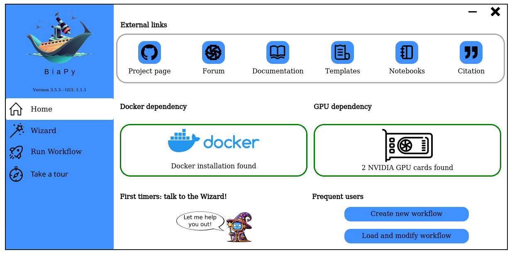
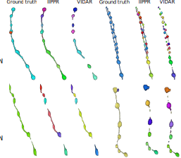
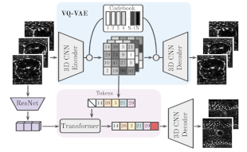
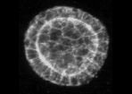
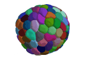
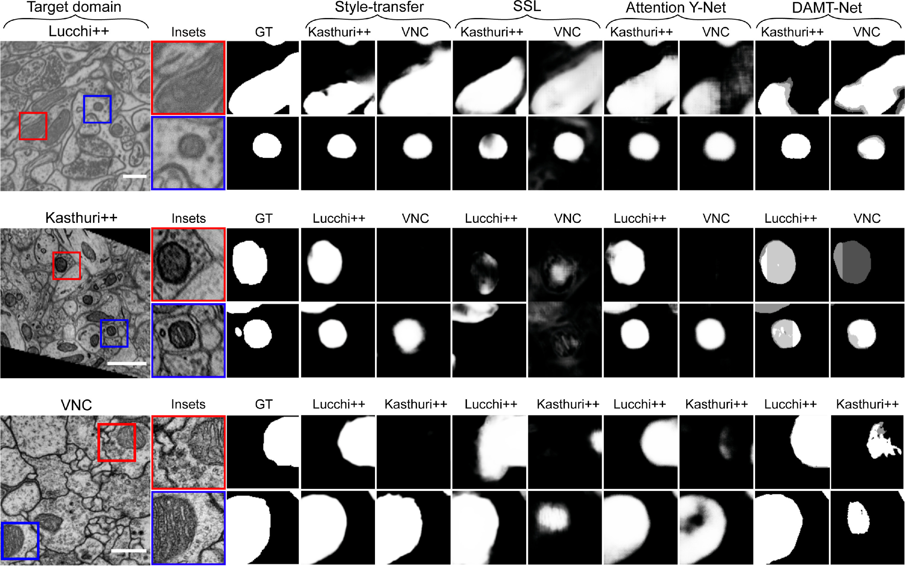
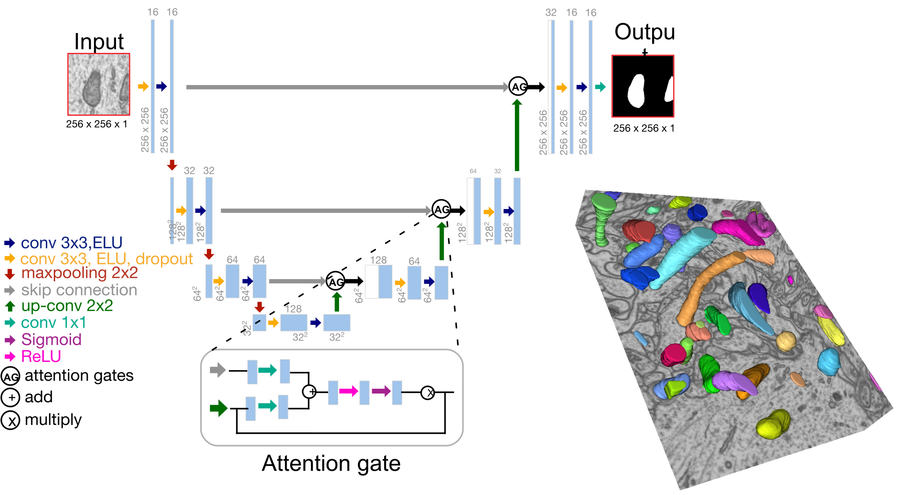

</a>

# BiaPy: Bioimage analysis pipelines in Python

<p align="left">
    <a href="https://www.python.org/">
      </a>
    <a href= "https://pytorch.org/">
      </a>
    <a href= "https://github.com/danifranco/BiaPy/blob/master/LICENSE">
      </a>
    <a href= "https://biapy.readthedocs.io/en/latest/">
      </a>
    <a href= "https://ieeexplore.ieee.org/abstract/document/10230593">
      </a>
</p>

[BiaPy](https://github.com/danifranco/BiaPy) is an open source Python library for building bioimage analysis pipelines. This repository is actively under development by the Biomedical Computer Vision group at the [University of the Basque Country](https://www.ehu.eus/en/en-home) and the [Donostia International Physics Center](http://dipc.ehu.es/). 

The library provides an easy way to create image processing pipelines that are typically used in the analysis of biology microscopy images in 2D and 3D. Namely, BiaPy contains ready-to-use solutions for the tasks of [semantic segmentation](https://biapy.readthedocs.io/en/latest/workflows/semantic_segmentation.html), [instance segmentation](https://biapy.readthedocs.io/en/latest/workflows/instance_segmentation.html), [object detection](https://biapy.readthedocs.io/en/latest/workflows/detection.html), [image denoising](https://biapy.readthedocs.io/en/latest/workflows/denoising.html), [single image super-resolution](https://biapy.readthedocs.io/en/latest/workflows/super_resolution.html), [self-supervised learning](https://biapy.readthedocs.io/en/latest/workflows/self_supervision.html) and [image classification](https://biapy.readthedocs.io/en/latest/workflows/classification.html). The source code is based on Pytorch as backend. Given BiaPy’s deep learning based core, a machine with a graphics processing unit (GPU) is recommended for fast training and execution.                                                                                                                                            
                                                                                                                                   
     
## User interface

You can also use BiaPy through our graphical user interface (GUI).

<kbd>
  
</kbd>

### Download BiaPy GUI for you OS

- [Windows 64-bit](https://github.com/danifranco/BiaPy-GUI/raw/main/dist-win/BiaPy.exe) 
- [Linux 64-bit](https://github.com/danifranco/BiaPy-GUI/raw/main/dist-linux/BiaPy) 
- [macOS 64-bit](https://github.com/danifranco/BiaPy-GUI/raw/main/dist-macOS/BiaPy-macOS.zip) 

### Project's page
[[BiaPy GUI](https://github.com/danifranco/BiaPy-GUI)]

## Applications using BiaPy

|                                                                                                                                                                                                                                                                                                                                                                                                                                                                                                                                                                                                                                                                                                                                                                                                                                                                                                                                                                                                                                                                                                                                                                                                                                      |                                                                                                                                                             |
|--------------------------------------------------------------------------------------------------------------------------------------------------------------------------------------------------------------------------------------------------------------------------------------------------------------------------------------------------------------------------------------------------------------------------------------------------------------------------------------------------------------------------------------------------------------------------------------------------------------------------------------------------------------------------------------------------------------------------------------------------------------------------------------------------------------------------------------------------------------------------------------------------------------------------------------------------------------------------------------------------------------------------------------------------------------------------------------------------------------------------------------------------------------------------------------------------------------------------------------|:-----------------------------------------------------------------------------------------------------------------------------------------------------------:|
| ```Franco-Barranco, Daniel, et al. "Current Progress and Challenges```  <br> ```in Large-scale 3D Mitochondria Instance Segmentation." (2023).``` <br><br> This paper reports the results of the MitoEM challenge on 3D instance segmentation <br> of mitochondria in electron microscopy images, held in conjunction with IEEE-ISBI  <br> 2021. The benchmark dataset is significantly larger than previous ones, with  <br> participation from 257 researchers and 14 teams. The paper discusses the  <br> top-performing methods, addresses ground truth errors, and proposes a new scoring  <br> system to improve segmentation evaluation. Despite progress, challenges remain in  <br> segmenting mitochondria with complex shapes, keeping the competition open for  <br> further submissions and evaluation with downloadable volumes. ```BiaPy``` is used in <br> the creation of the MitoEM challenge baseline (U2D-BC).  <br><br> [[Documentation](https://biapy.readthedocs.io/en/latest/tutorials/mitoem.html)] [[Paper](https://ieeexplore.ieee.org/document/10266382)] [[Toolbox](https://github.com/danifranco/TIMISE)] |                                                  </a>                                                 |
| ```Backová, Lenka, et al. "Modeling Wound Healing Using Vector Quantized``` <br> ```Variational Autoencoders and Transformers." 2023 IEEE 20th``` <br> ```International Symposium on Biomedical Imaging (ISBI). IEEE, 2023.``` <br><br> Wound healing is a vital process in animals with significant medical implications, <br> such as scarless healing and post-surgery recovery improvement. This study focuses <br> on time-lapse sequences of Drosophila embryos healing from laser-incised wounds. <br> The researchers employ a two-stage approach involving a vector quantized variational <br> autoencoder and an autoregressive transformer to model wound healing as a video  <br> prediction task. The trained model generates realistic videos based on initial  <br> frames and is evaluated using distortion measures and perceptual quality metrics. <br> Results indicate low pixel-level errors and realistic behavior, demonstrating the <br> neural network's ability to model the wound-closing process. ```BiaPy``` is used in the <br> creation of the wound segmentation masks. <br><br> [[Documentation](https://lenkaback.github.io/wound-healing-modeling/)] [[Paper](https://ieeexplore.ieee.org/document/10230571)] | </a> |
| ```Andrés-San Román, Jesús A., et al. "CartoCell, a high-content``` <br> ```pipeline for 3D image analysis, unveils cell morphology patterns```  <br> ```in epithelia." Cell Reports Methods (2023)``` <br><br>  Extensive research has yet to fully explain epithelial self-organization and 3D <br> packing mechanisms. Analyzing individual cells in 3D epithelial collections is  <br> vital for tissue comprehension. Combining deep learning and 3D imaging is crucial <br> for high-content analysis. CartoCell is introduced, a method that accurately labels <br> 3D epithelial cysts, enabling quantification of cellular features and mapping their  <br> distribution. It's adaptable to other epithelial tissues. Cartocell method is created  <br> using ```BiaPy```. <br><br>  [[Documentation](https://biapy.readthedocs.io/en/latest/tutorials/cartocell.html)] [[Paper](https://www.cell.com/cell-reports-methods/pdf/S2667-2375(23)00249-7.pdf)]                                                                                                                                                                                                                                                                  | <table>   <tr>     <td></td>     <td></td>   </tr> </table> |
| ```Franco-Barranco, Daniel, et al. "Deep learning based domain```  <br> ```adaptation for mitochondria segmentation on EM volumes." ``` <br> ```Computer Methods and Programs in Biomedicine 222 (2022): 106949.```   <br><br> Accurate electron microscopy (EM) brain volume segmentation is crucial for  <br> understanding neuronal structures. Deep learning methods have made progress but <br> struggle with domain adaptation, where models trained on one dataset underperform <br> on another. This study addresses mitochondria segmentation across different <br> datasets using three unsupervised domain adaptation approaches, including <br> style transfer, self-supervised learning, and multi-task neural networks.  <br> To ensure robust generalization, a new training stopping criterion based <br> on source domain morphological priors is proposed. ```BiaPy``` is used for the  <br> implementation of the Attention U-Net. <br><br> [[Documentation](https://github.com/danifranco/EM_domain_adaptation)] [[Paper](https://www.sciencedirect.com/science/article/pii/S0169260722003315)]                                                                                                                  |                                                                                                                      |
| ```Franco-Barranco, Daniel, et al. "Stable deep neural network ``` <br> ```architectures for mitochondria segmentation on electron microscopy``` <br> ```volumes." Neuroinformatics 20.2 (2022): 437-450.``` <br><br> Electron microscopy (EM) aids in identifying intracellular organelles like mitochondria, <br> crucial for clinical and scientific research. Recent deep learning models have shown <br> impressive performance, but often lack code and training details, affecting <br> reproducibility. This study follows best practices, comprehensively comparing  <br> state-of-the-art architectures and variations of U-Net models for mitochondria  <br> segmentation, revealing their impact and stability. The research consistently  <br> achieves state-of-the-art results on various datasets, including EPFL Hippocampus, <br> Lucchi++, and Kasthuri++. ```BiaPy``` is used for the implementation of the methods <br> compared in the study. <br><br> [[Documentation](https://biapy.readthedocs.io/en/latest/tutorials/stable.html)] [[Paper](https://link.springer.com/article/10.1007/s12021-021-09556-1)]                                                                                                 |                                                                                                              |
| ```Wei, Donglai, et al. "Mitoem dataset: Large-scale 3d mitochondria``` <br> ```instance segmentation from em images." International Conference on``` <br> ```Medical Image Computing and Computer-Assisted Intervention. Cham: ``` <br> ```Springer International Publishing, 2020.``` <br><br> Electron microscopy (EM) aids in identifying cellular organelles like mitochondria, vital <br> for clinical and scientific research. However, existing mitochondria segmentation  <br> datasets are small, raising questions about method robustness. The MitoEM dataset <br> introduces larger 3D volumes with diverse mitochondria, challenging existing instance <br> segmentation methods, highlighting the need for improved techniques. ```BiaPy``` is used  <br> in the creation of the MitoEM challenge baseline (U2D-BC). <br><br> [[Documentation](https://biapy.readthedocs.io/en/latest/tutorials/mitoem.html)] [[Paper](https://link.springer.com/chapter/10.1007/978-3-030-59722-1_7)] [[Challenge](https://mitoem.grand-challenge.org/)]                                                                                                                                                                             |                                                                                              |

## Authors

| Name                                                                               | Role                                     | Affiliations                                                                                                                                                                                                                                                        |
|------------------------------------------------------------------------------------|------------------------------------------|---------------------------------------------------------------------------------------------------------------------------------------------------------------------------------------------------------------------------------------------------------------------|
| [Daniel Franco-Barranco](https://danifranco.github.io/)                            | Creator, Implementation, Software design | <ul> <li> Dept. of Computer Science and Artificial Intelligence, University of the Basque Country (UPV/EHU)  </li> <li>  Donostia International Physics Center (DIPC) </li> </ul>                                                                                   |
| [Ignacio Arganda-Carreras](https://www.ikerbasque.net/es/ignacio-arganda-carreras) | Supervision, Implementation              | <ul> <li> Dept. of Computer Science and Artificial Intelligence, University of the Basque Country (UPV/EHU) </li> <li> Donostia International Physics Center (DIPC)  </li> <li> IKERBASQUE, Basque Foundation for Science </li> <li>Biofisika Institute </li> </ul> |
| [Arrate Muñoz-Barrutia](https://image.hggm.es/es/arrate-munoz)                     | Supervision                              | <ul> <li> Dept. de Bioingenieria, Universidad Carlos III de Madrid </li> </ul>                                                                                                                                                                                      |


## External collaborators

| Name                                                                                               | Role                        | Affiliations                                                                                                                                                                                                                                                                                                                                                     |
|----------------------------------------------------------------------------------------------------|-----------------------------|------------------------------------------------------------------------------------------------------------------------------------------------------------------------------------------------------------------------------------------------------------------------------------------------------------------------------------------------------------------|
| [Jesús Ángel Andrés-San Román](https://scholar.google.es/citations?user=OfDu4q4AAAAJ&hl=en&oi=sra) | Implementation              | <ul> <li>Instituto de Biomedicina de Sevilla (IBiS), Hospital Universitario Virgen del Rocío/CSIC/Universidad de Sevilla  <br> and Dept. de Biología Celular, Facultad de Biología, Universidad de Sevilla </li> <li> Biomedical Network Research Centre on Neurodegenerative Diseases (CIBERNED) </li> </ul>                                                    |
| [Pedro Javier Gómez Gálvez](https://scholar.google.es/citations?user=aWeyQGUAAAAJ&hl=en&oi=sra)    | Supervision, Implementation | <ul> <li>Instituto de Biomedicina de Sevilla (IBiS), Hospital Universitario Virgen del Rocío/CSIC/Universidad de Sevilla  <br> and Dept. de Biología Celular, Facultad de Biología, Universidad de Sevilla </li> <li> MRC Laboratory of Molecular Biology </li> <li> Department of Physiology, Development and Neuroscience, University of Cambridge </li> </ul> |
| [Luis M. Escudero](http://www.scutoids.es/)                                                        | Supervision                 | <ul> <li>Instituto de Biomedicina de Sevilla (IBiS), Hospital Universitario Virgen del Rocío/CSIC/Universidad de Sevilla  <br> and Dept. de Biología Celular, Facultad de Biología, Universidad de Sevilla </li> <li> Biomedical Network Research Centre on Neurodegenerative Diseases (CIBERNED) </li> </ul>                                                    |
| [Iván Hidalgo Cenalmor](https://henriqueslab.github.io/team/2023-03-16-IH/)                        | Implementation              | <ul> <li> Optical cell biology group, Instituto Gulbenkian de Ciência, Oerias, Portugal </li> </lu>                                                                                                                                                                                                                                                              |

## Citation
```
Franco-Barranco, Daniel, et al. "BiaPy: a ready-to-use library for Bioimage Analysis Pipelines." 2023 IEEE 20th International Symposium on Biomedical Imaging (ISBI). IEEE, 2023.
``` 
