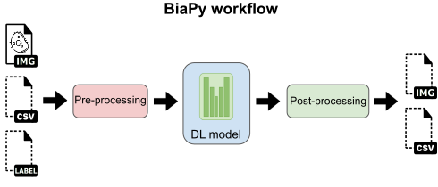

How it works
------------

All BiaPy pipelines are composed of three main steps: data pre-processing, deep learning (DL) model training or inference, and data post-processing. 

  
  General scheme of a BiaPy pipeline/workflow. Dash-lined elements are optional.

Pre-processing
~~~~~~~~~~~~~~

Before the training or inference stage, BiaPy prepares the input data usually by creating 2D/3D image patches and normalizing the pixel/voxel intensities. Furthermore, some workflows require adapting the input data into a representation that can be fed to the DL model. This is the case of the instance segmentation pipelines, where the label images are transformed into binary masks, contours and distance maps ; and also the object detection pipelines, where the point detection lists are transformed into point mask images.

Training
~~~~~~~~

After pre-processing stage the training of the model is performed. The DL model is trained by example where an input and a target output need to be specified. The purpose of the DL model is to generate an output as closest as possible to the provided target data, also called ground truth. 

To create more training data a data augmentation (DA) is applied. DA converts the input image applying some transformation to it, e.g. random rotation or flips, so the model is feed with a different version of the original image. Furthermore, this technique alleviates the problem of overfitting, that happens when a model learns the detail and noise in the training data to the extent that it negatively impacts the performance of the model on new data.

Apart for the DA, in the training stage is also common to define a validation set to prevent model overfitting. This way, the training process can be monitorized so it is stopped when no improvement is seeing in the validation data after some defined epochs (this is called patience). An epoch refers to see all the images in the training data. This process is repeated again and again. This way, epoch by epoch, the model can learn to map input images to their respective target. 

Inference
~~~~~~~~~

After the training process is done the inference, or prediction, phase comes. The idea is pass through the model images of the same type used to train so it can produce its corresponding target. If the ground truth exists it can be compared with the model's output to measure its performance. Different metrics are used depending on the workflow. 

Post-processing
~~~~~~~~~~~~~~~

Most frequently, the output of the DL models needs to be post-processed to achieve the desired results. The post-processing methods implemented in BiaPy include simple binarization (for semantic segmentation), z-filtering (for 3D data), marker-controlled watershed and Voronoi tessellation (for instance segmentation), and close point suppression (for object detection), among others. 