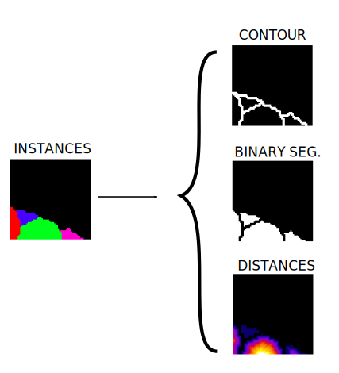

.. _cysto_tutorial:

3D Cysto Instance Segmentation
-------------------------------

Problem description
~~~~~~~~~~~~~~~~~~~

The goal is to segment and identify automatically each cysto in EM images. This is an instance segmentation problem,
which is the next step of semantic segmentation, as its requires identifying each blob unequivocally with a given
id. In this tutorial, pairs of EM 3D images (``X``) with their corresponding instance sementation annotations
(``Y``) are provided. Here a cysto dataset (not released yet) is used. In this dataset some 3D images of multiple
shapes are used for train and other cystos are used for test. Here is a sample:

.. figure:: ../video/cyst_sample.gif
  :scale: 60%
  :alt: Cysto image sample
  :align: center

  Overview of one cysto image.

Data preparation
~~~~~~~~~~~~~~~~

The data directory tree should follow the structure described `First steps -> Step 1: Data preparation <../how_to_run/first_steps.html#step-1-data-preparation>`_.

Problem resolution
~~~~~~~~~~~~~~~~~~

To produce the cysto instances two main steps are done:

* Firstly, new ``Y'`` data representations are created from the original ``Y``. This new ``Y'`` data is created with up to three channels (controlled by ``DATA.CHANNELS``). Binary segmentation (referred as ``B`` in the code), contour (``C``) and distances (``D``). This way, the network will be trained with a bunch of image pairs, each containing an EM image and its ``Y'`` new data representation.

  Process of the new ``Y'`` data representation: from instance segmentation labels (left) to contour, binary segmentation
  and distances (right). Here a patch ``(64, 64, 64)`` is presented just for visualization but the process is done for
  each full resolution image.

* These extra channels predicted by the network are used to create the final instance segmentation labels using a marked controlled watershed (MW). This process involve a few thresholds that may be adjusted depending each case: ``DATA.MW_TH1``, ``DATA.MW_TH2``, ``DATA.MW_TH3``, ``DATA.MW_TH4`` and ``DATA.MW_TH5``. Find their description in `config.py <https://github.com/danifranco/EM_Image_Segmentation/blob/master/config/config.py>`_.

Configuration file
~~~~~~~~~~~~~~~~~~

To create the YAML file you can use the template `resunet_3d_instances_bcd.yaml <https://github.com/danifranco/EM_Image_Segmentation/blob/master/templates/resunet_3d_instances_bcd.yaml>`_ which is prepared for this tutorial.

.. seealso::

   Adapt the configuration file to your specific case and see more configurable options available at `config.py <https://github.com/danifranco/EM_Image_Segmentation/blob/master/config/config.py>`_.

Run
~~~

Run the code with any of the options described in **HOW TO RUN** section that best suits you. For instance, you can run 
it through bash shell as described in: `Bash Shell -> Step 2: Run the code <../how_to_run/bash.html#step-2-run-the-code>`_.

Results
~~~~~~~

The resulting instance segmentation should be something like this:

.. figure:: ../video/cyst_instance_prediction.gif 
  :scale: 60% 
  :alt: Cysto instance segmentation results
  :align: center                                                                
                                                                                
  Instance segmentation results for the cysto.
    
