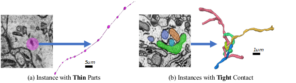
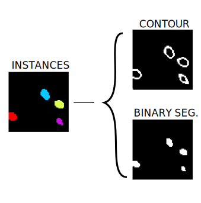

.. _mito_tutorial:

2D Mitochondria instance segmentation
-------------------------------------

Problem description
~~~~~~~~~~~~~~~~~~~

The goal is to segment automatically mitochondria instances in EM images. The difference
between this tutotorial and `2D Mitochondria segmentation <mitochondria.html>`_ is that here 
we need to identify each mitochondria separately, labelling each one with a unique identifier.
This type of problem is called instance segmentation and can be seen as the next step of semantic
segmentation. In this tutorial, pairs of EM 2D images (``X``) with their corresponding instance
sementation annotations (``Y``) are provided. Here MitoEM dataset :cite:p:`wei2020mitoem` is used:

.. list-table::

  * - .. figure:: ../img/mitoem_crop.png
         :align: center

         Human EM tissue image sample. 

         Crop of ``(1200,1200)``.

    - .. figure:: ../img/mitoem_crop_mask.png
         :align: center

         Its corresponding instance mask.

         Crop of ``(1200,1200)``.

MitoEM dataset is composed by two EM volumes from human and rat cortices, named MitoEM-H and MitoEM-R respectively. Each 
volume has a size of ``(1000,4096,4096)`` voxels, for ``(z,x,y)`` axes. They are divided in ``(500,4096,4096)`` for
train, ``(100,4096,4096)`` for validation and ``(500,4096,4096)`` for test. Both tissues contain multiple instances
entangling with each other with unclear boundaries and complex morphology, e.g., (a) mitochondria-on-a-string (MOAS)
instances are connected by thin microtubules, and (b) multiple instances can entangle with each other.

Data preparation                                                                                                        
~~~~~~~~~~~~~~~~                                                                                                        
                                                                                                                        
The data directory tree should follow the structure described `First steps -> Step 1: Data preparation <../how_to_run/first_steps.html#step-1-data-preparation>`_. To adapt the ``.h5`` file format provided by MitoEM authors into ``.tif`` files you can use the script `h5_to_tif.py <https://github.com/danifranco/BiaPy/blob/master/utils/scripts/h5_to_tif.py>`_.
                                                                                                                        
                                                                                                                        
Problem resolution                                                                                                      
~~~~~~~~~~~~~~~~~~     

To produce the mitochondria instances two main steps are done:

* Firstly, new ``Y'`` data representations are created from the original ``Y``. This new ``Y'`` data is created with up to three channels (controlled by ``DATA.CHANNELS``). In this problem only two channels are presented: binary segmentation (referred as ``B`` in the code) and contour (``C``). This way,  the network will be trained with MitoEM slices, that is to say, image pairs each one containing an EM image and its ``Y'`` new data representation.

  Process of the new ``Y'`` data representation: from instance segmentation labels (left) to contour and binary
  segmentation (right).

* These extra channels predicted by the network are used to create the final instance segmentation labels using a marked controlled watershed (MW). This process involve a few thresholds that may be adjusted depending each case: ``DATA.MW_TH1``, ``DATA.MW_TH2`` and ``DATA.MW_TH3``. Find their description in `config.py <https://github.com/danifranco/BiaPy/blob/master/config/config.py>`_.

Configuration file
~~~~~~~~~~~~~~~~~~

To create the YAML file you can use the template `unet_2d_MitoEM.yaml <https://github.com/danifranco/BiaPy/blob/master/templates/unet_2d_MitoEM.yaml>`_ which is prepared for this tutorial.

.. seealso::

   Adapt the configuration file to your specific case and see more configurable options available at `config.py <https://github.com/danifranco/          BiaPy/blob/master/config/config.py>`_.

Run                                                                                                                     
~~~                                                                                                                     
                                                                                                                        
Run the code with any of the options described in **HOW TO RUN** section that best suits you. For instance, you can run 
it through bash shell as described in: `Bash Shell -> Step 2: Run the code <../how_to_run/bash.html#step-2-run-the-code>`_.

.. warning::

   If you train with all MitoEM training data the workflow requires at least 260GB of memory (peak). To not load the entire
   training/validation data you can set ``DATA.TRAIN.IN_MEMORY`` to False, and ``DATA.VAL.IN_MEMORY`` too, together with
   ``DATA.EXTRACT_RANDOM_PATCH`` to True. This option will decrease the performance but will save memory, as consist in
   loading each sample directly from the disk in each batch, instead of having it loaded in memory, and extracting a
   random patch of shape given by ``DATA.PATCH_SIZE``. Find more information about the variables in
   `config.py <https://github.com/danifranco/BiaPy/blob/master/config/config.py>`_.

   Another way to go can be to crop the dataset before training with ``DATA.PATCH_SIZE`` to avoid the ovearhead of
   extracting a random patch with ``DATA.EXTRACT_RANDOM_PATCH`` option. For this last recommendation you can use the
   script `crop_2D_dataset.py <https://github.com/danifranco/BiaPy/blob/master/utils/scripts/crop_2D_dataset.py>`_
   to crop the dataset. 

  
Results                                                                                                                 
~~~~~~~  

The results are placed in ``results`` folder under ``--result_dir`` directory with the ``--name`` given. See `Step-4-analizing-the-results <../how_to_run/first_steps.html#step-4-analizing-the-results>`_ to find more details about the files and directories created. There 
you should find something similiar to these results:

.. list-table::

  * - .. figure:: ../img/mitoem_crop_mask.png
         :align: center

         MitoEM-H train sample's GT.

         Crop of ``(1200,1200)``.

    - .. figure:: ../img/mitoem_pred.png
         :align: center

         MitoEM-H train prediction.

         Crop of ``(1200,1200)``.

Evaluation
~~~~~~~~~~

To evaluate the quality of the results there are different options implemented for instance segmentation:

- IoU values will be printed when ``DATA.TEST.LOAD_GT`` is True, as we have GT to compare the predictions with. The results
  will be divided in: per patch, merging patches and full image depending on the options selected to True in
  ``TEST.STATS.*`` variable. Notice that the IoU are only calculated over binary channels (``BC``) and not in distances
  ones (``D`` or ``Dv2``). 

- mAP for instance segmentation (introduced in :cite:p:`wei2020mitoem`) with ``TEST.MAP`` to True. It requires the path
  to the code to be set in ``PATHS.MAP_CODE_DIR``. Find `mAP_3Dvolume <https://github.com/danifranco/mAP_3Dvolume>`_ and
  more information of the implementation in :cite:p:`wei2020mitoem`. If ``TEST.VORONOI_ON_MASK`` is True separate values 
  are printed, before and after applying it. Follow this steps to download have mAP ready for use:
  
.. code-block:: bash

     git clone https://github.com/danifranco/mAP_3Dvolume.git
     git checkout grand-challenge
  
- Other common matching statistics as precision, accuracy, recall, F1 and panoptic quality measured in the way Stardist
  (:cite:p:`schmidt2018cell,weigert2020star`) does. Set ``TEST.MATCHING_STATS`` to True and control the IoU thresholds
  with ``TEST.MATCHING_STATS_THS`` variable. 

MitoEM challenge submission
~~~~~~~~~~~~~~~~~~~~~~~~~~~

There is a open challenge for MitoEM dataset: https://mitoem.grand-challenge.org/

To prepare ``.h5`` files from resulting instance predictions in ``.tif`` format you can use the script `tif_to_h5.py <https://github.com/danifranco/BiaPy/blob/master/utils/scripts/tif_to_h5.py>`_. The instances of both Human and Rat tissue need to be provided 
(files must be named as ``0_human_instance_seg_pred.h5`` and ``1_rat_instance_seg_pred.h5`` respectively). Find the full
details in the challenge page. 

Citation
~~~~~~~~

This workflow was used to make the following work: ::

    @inproceedings{wei2020mitoem,
                   title={MitoEM dataset: large-scale 3D mitochondria instance segmentation from EM images},
                   author={Wei, Donglai and Lin, Zudi and Franco-Barranco, Daniel and Wendt, Nils and Liu, Xingyu and Yin, Wenjie and Huang, Xin and Gupta, Aarush and Jang, Won-Dong and Wang, Xueying and others},
                   booktitle={International Conference on Medical Image Computing and Computer-Assisted Intervention},
                   pages={66--76},
                   year={2020},
                   organization={Springer}
        }
