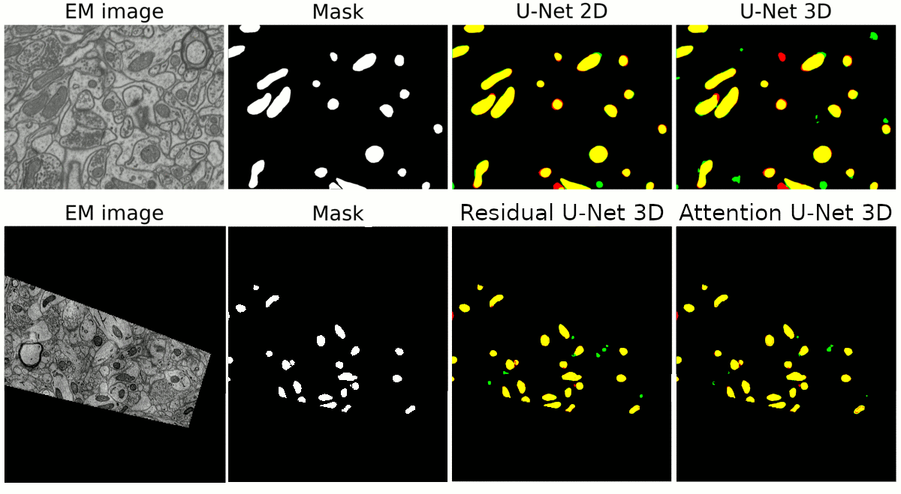

.. _stable:

Stable DNN architectures for mitochondria segmentation
------------------------------------------------------

This tutorial describes how to reproduce the results reported in our paper to 
make semantic segmentation of mitochondria in electron microscopy (EM) images: ::

    @Article{Franco-Barranco2021,
        author={Franco-Barranco, Daniel and Muñ{\~{n}}oz-Barrutia, Arrate and Arganda-Carreras, Ignacio},
        title={Stable Deep Neural Network Architectures for Mitochondria Segmentation on Electron Microscopy Volumes},
        journal={Neuroinformatics},
        year={2021},
        month={Dec},
        day={02},
        issn={1559-0089},
        doi={10.1007/s12021-021-09556-1},
        url={https://doi.org/10.1007/s12021-021-09556-1}
    }

Problem description
~~~~~~~~~~~~~~~~~~~

The goal is to segment automatically mitochondria in EM images as described in :ref:`semantic_segmentation`. This is a semantic segmentation problem where pairs of EM image and its corresponding mitochodria mask are provided. Our purpose is to segment automatically other mitochondria in images not used during train labeling each pixel with the corresponding class: background or foreground (mitochondria in this case). As an example, belown are shown two images from EPFL Hippocampus dataset used in this work: 

.. list-table:: 

  * - .. figure:: ../img/FIBSEM_test_0.png
         :align: center

         EM tissue image

    - .. figure:: ../img/FIBSEM_test_0_gt.png
         :align: center

         Corresponding mask 

Installation
~~~~~~~~~~~~

Apart from the steps described in :ref:`installation`, to reproduce exact results of our paper you need to use the `V1.0 <https://github.com/danifranco/BiaPy/releases/tag/v1.0>`__ version of our library. For that, you simply need to run this command in the terminal ::

    git checkout v1.0

If you need help to open a terminal find help in :ref:`installation_command_line`. 

Data preparation
~~~~~~~~~~~~~~~~

There are differents datasets used on the above work: 

- `EPFL Hippocampus/Lucchi <https://www.epfl.ch/labs/cvlab/data/data-em/>`__.
- `Lucchi++ <https://sites.google.com/view/connectomics/>`__.
- `Kasthuri++ <https://sites.google.com/view/connectomics/>`__.

Prepare the data as described :ref:`semantic_segmentation_data_prep`.

Choose a template
~~~~~~~~~~~~~~~~~

You can use any of the templates from our ``V1.0`` version of BiaPy in the `templates folder <https://github.com/danifranco/BiaPy/tree/v1.0/templates>`__. 

In case you are interested in reproducing one of the state-of-the-art works implemented in our manuscript, you can use the templates prepared on each case:

    - Casser et al: [`Paper <https://www.researchgate.net/profile/Daniel-Haehn-2/publication/329705779_Fast_Mitochondria_Segmentation_for_Connectomics/links/5c1ab85b458515a4c7eb0569/Fast-Mitochondria-Segmentation-for-Connectomics.pdf>`__] ; [`Our code <https://github.com/danifranco/BiaPy/tree/v1.0/sota_implementations/casser_2018/>`__] ; [`Template <https://github.com/danifranco/BiaPy/tree/v1.0/sota_implementations/casser_2018/casser_template_V1.py>`__] ; [|cassercolablink|] 
    - Cheng et al (2D): [`Paper <https://ieeexplore.ieee.org/stamp/stamp.jsp?arnumber=8296349>`__] ; [`Our code <https://github.com/danifranco/BiaPy/tree/v1.0/sota_implementations/cheng_2017/>`__] ; [`Template <https://github.com/danifranco/BiaPy/tree/v1.0/sota_implementations/cheng_2017/cheng_2D_template_V1.py>`__] ; [|chengcolablink|] 
    - Cheng et al (3D): [`Paper <https://ieeexplore.ieee.org/stamp/stamp.jsp?arnumber=8296349>`__] ; [`Our code <https://github.com/danifranco/BiaPy/tree/v1.0/sota_implementations/cheng_2017/>`__] ; [`Template <https://github.com/danifranco/BiaPy/tree/v1.0/sota_implementations/cheng_2017/cheng_3D_template_V1.py>`__] ; [|cheng3dcolablink|] 
    - Xiao et al: [`Paper <https://www.frontiersin.org/articles/10.3389/fnana.2018.00092/full>`__] ; [`Our code <https://github.com/danifranco/BiaPy/tree/v1.0/sota_implementations/xiao_2018/>`__] ; [`Template <https://github.com/danifranco/BiaPy/tree/v1.0/sota_implementations/xiao_2018/xiao_template_V1.py>`__] ; [|xiaocolablink|] 
    - Oztel et al: [`Paper <https://ieeexplore.ieee.org/document/8217827>`__] ; [`Our code <https://github.com/danifranco/BiaPy/tree/v1.0/sota_implementations/oztel_2017/>`__] ; [`Template <https://github.com/danifranco/BiaPy/tree/v1.0/sota_implementations/oztel_2017/oztel_template_V1.py>`__] ; [|oztelcolablink|] 

.. |cassercolablink| image:: https://colab.research.google.com/assets/colab-badge.svg
    :target: https://colab.research.google.com/github/danifranco/BiaPy/blob/master/templates/sota_implementations/Casser_workflow.ipynb

.. |chengcolablink| image:: https://colab.research.google.com/assets/colab-badge.svg
    :target: https://colab.research.google.com/github/danifranco/BiaPy/blob/master/templates/sota_implementations/Cheng_2D_workflow.ipynb

.. |cheng3dcolablink| image:: https://colab.research.google.com/assets/colab-badge.svg
    :target: https://colab.research.google.com/github/danifranco/BiaPy/blob/master/templates/sota_implementations/Cheng_3D_workflow.ipynb

.. |xiaocolablink| image:: https://colab.research.google.com/assets/colab-badge.svg
    :target: https://colab.research.google.com/github/danifranco/BiaPy/blob/master/templates/sota_implementations/Xiao_workflow.ipynb

.. |oztelcolablink| image:: https://colab.research.google.com/assets/colab-badge.svg
    :target: https://colab.research.google.com/github/danifranco/BiaPy/blob/master/templates/sota_implementations/Oztel_workflow.ipynb

Run
~~~

The procedure to run the library is slightly different as it is now for the last version of BiaPy. In this version, the library name was ``EM_Image_Segmentation`` and there were no YAML based configuration files to run it. 

**Command line**: Open a terminal as described in :ref:`installation`. For instance, using `resunet_2d_semantic_segmentation.yaml <https://github.com/danifranco/BiaPy/blob/master/templates/semantic_segmentation/resunet_2d_semantic_segmentation.yaml>`__ template file, the code can be run as follows:

.. code-block:: bash
    
    # Path to the code 
    code_dir="/home/user/BiaPy"  
    # Path to the dataset
    data_dir="/home/user/dataset" 
    # Path where the output data will be generated
    job_dir="/home/user/out_dir"  
    # Just a name for the job
    job_id="400"
    # Number that should be increased when one need to run the same job multiple times (reproducibility)
    job_counter=1
    # Number of the GPU to run the job in (according to 'nvidia-smi' command)
    gpu_number="0"                   

    # Load the environment
    conda activate DL_EM_base_env
    
    python -u template.py \
           $code_dir \
           $data_dir \
           $job_dir \
           --id $job_id \
           --rid $job_counter \
           --gpu $gpu_number 

**Colab**: The fastest and easiest way to run it is via Google Colab |colablink|

.. |colablink| image:: https://colab.research.google.com/assets/colab-badge.svg
    :target: https://colab.research.google.com/github/danifranco/BiaPy/blob/master/templates/notebooks/old_notebooks/v1.0_semantic_segmentation_workflow.ipynb

Results
~~~~~~~

The results follow same structure as explained in :ref:`semantic_segmentation_results`.

                                                           

    Results of different models used in the manuscript.

